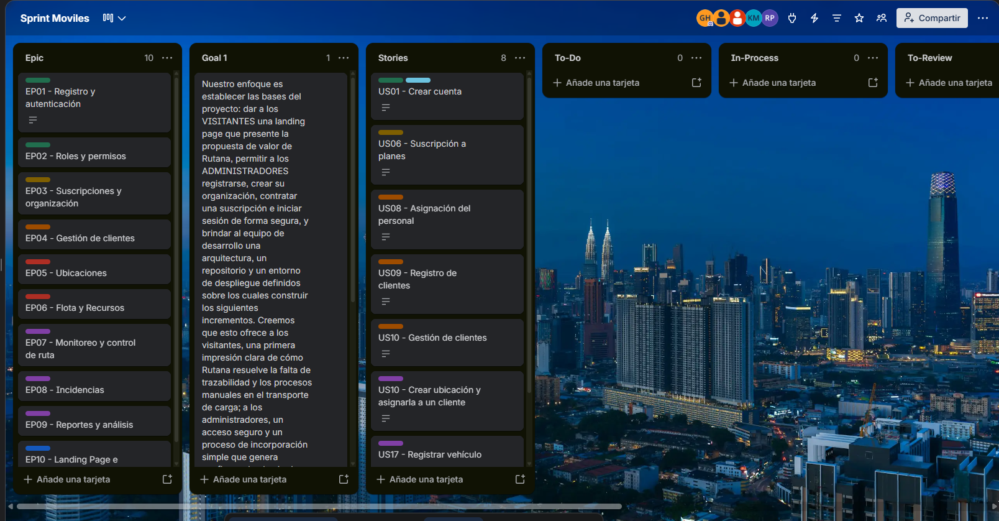
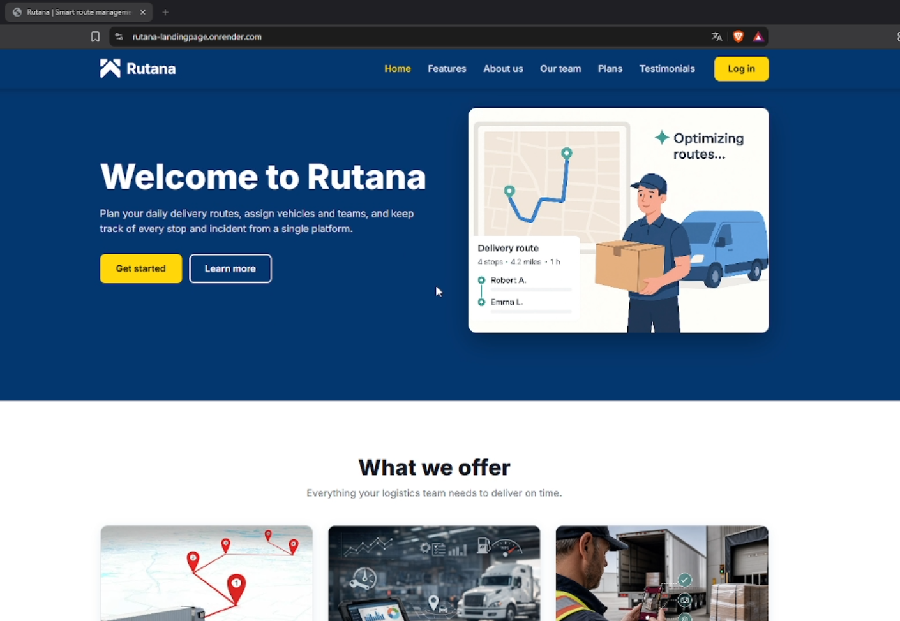
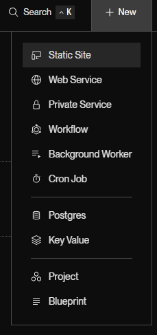
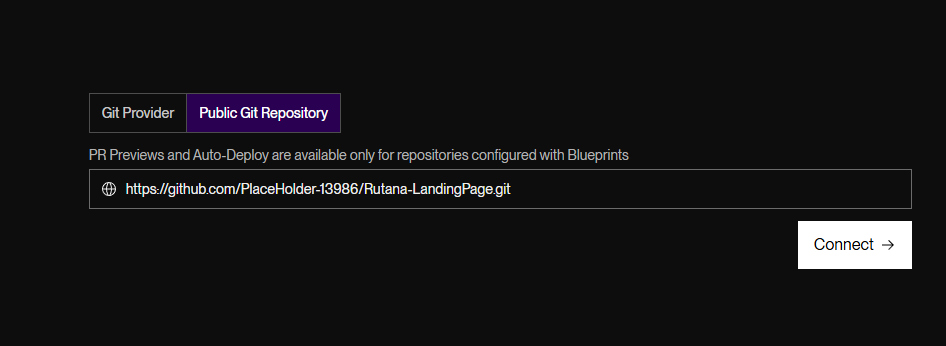
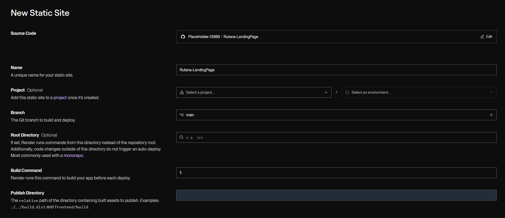
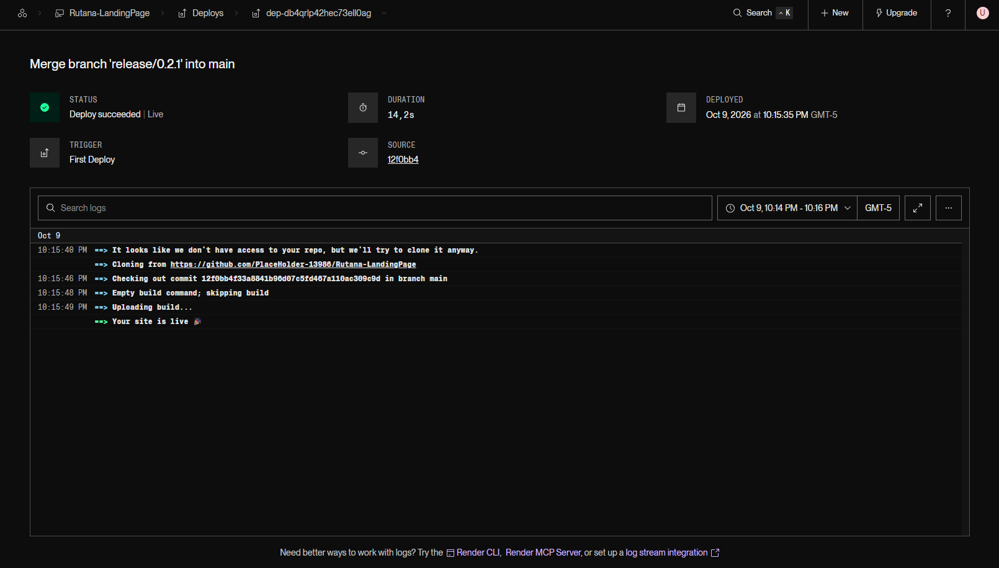
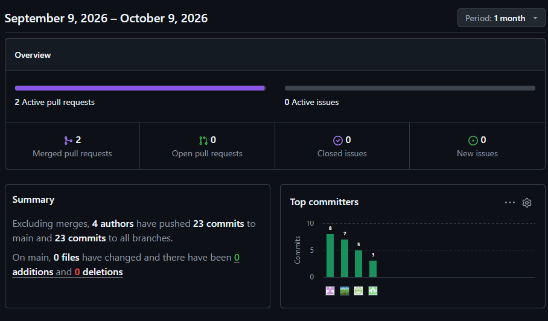
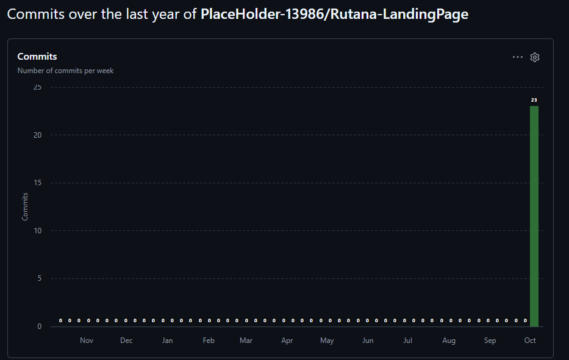

# Capítulo IV: Product Implementation & Validation

# 4. Product Implementation & Validation

## 4.1. Software Configuration Management

### 4.1.1 Software Development Environment Configuration
|Actividad|Herramientas/Guía|Propósito| Tipo de acceso /Ruta |
|---------|-----------------|----------|--------------------|
|Gestión de proyecto|Trello|Organizar y dar seguimiento a las tareas asignadas|[Trello][1]|
|Gestión de requerimientos|Gherkin Conventions|Definir criterios de aceptación y validación para los user stories|[Guía Gherkin][2]|
|Producto UI/UX|Figma|Diseño de interfaces (wireframes y mockups) y prototipos|[Figma][3]|
|Landing Page|Visual Studio Code|Edición y desarrollo del código de las pantallas|[VS Code][4]|
|Control de versiones|Git|Gestión de versiones del código de la Landing Page, FrontEnd y BackEnd|[Git][5]|
|Event Storming|Miro|Colaboración y modelado de los procesos involucrados en los Bounded Context|[Miro][7]|
|Diagramas|PlantUML|Generación de diagramas UML requeridos de la aplicación|[PlantUML][8]|
    
### 4.1.2. Source Code Management

Para el manejo del codigo fuente de Rutana se organiza en repositorios independientes que facilita la gestión, revisión y el despliegue de los diferentes artefactos del proyecto.

|     Artefacto     |     URL del Repositorio  |   
|:---: |:---: | 
| Proyect Report  | [Report][9] |
| Landing Page  | [LandingPage][10] |
| FrontEnd Web Application  | [FrontEnd][11] |
| BackEnd Web Services  | [Backend][12] |

##### GitFlow WorFlow

Se implemento GitFlow cómo flujo de trabajo para organizar el desarrollo de los artefactos por funcionalidades, mantener una separación del codigo para evitar errores y mantener ramas de desarrollos especificas para cada módulo o bounded context

###### Ramas principales

1.  main: Rama pincipal para versiones estables y desplegables de los artefactos
2.  develop: Rama de integración utilizada para consolidar las funcionalidades o cambios previos a la versión final del producto

###### Ramas de soporte

1.  feature/*:  Rama creada a partir del develop para poder implementar nuevas funcionalidades.

Convención: `feature/<nombre-corto-descriptivo>`
Ejemplo: `feature/chapter 1`

2.  docs/*: Ramas creadas para los cambios relacionados a la documentación del proyecto.

Convención: ` docs/<parte-del-documento>`  
Ejemplo: `docs/presentation`

3.  fix/*: Ramas utilizadas para corregir errores criticos en los artefactos.

Convención:  `hotfix/<descripción-corta>`
Ejemplo: `hotfix/fix-item-validation`

##### Semantic Versioning

Se aplica Semantic Versioning 2.0.0, con el formato:

- **MAJOR**: Cambios incompatibles con las versiones anteriores del artefacto.
- **MINOR**: Nuevas funcionalidades compatibles con versiones anteriores del artefacto.
- **PATCH**: Correcciones menores y ajustes sin afectar funcionalidades del artefacto.

Ejemplo de versión: `v1.3.2`

##### Conventional Commits

La organización utilizó la especificación de los Conventional Commits para mantener un orden y claridad en los mensajes de cada commit realizado por los integrantes. En este caso la estructura general de cada commit seria la siguiente: ` tipo(enfoque opcional): <descripción> `

Ejemplos de los commits utilizados

-  **chore: setup initial folder structure and empty markdown files**
-  **docs(chap-5): added headers for Chapter 5**
-  **fix(chap 1-2): fix merging problems for Chapter 1 and 2**

### 4.1.3. Source Code Style Guide & Conventions

En esta sección se describen las convenciones de estilo y nomenclatura adoptadas para los lenguajes, frameworks y librerías utilizados en la aplicación móvil de BevTrace, desarrollada de forma nativa en Android Studio con Kotlin, Jetpack Compose y persistencia local en SQLite mediante Room.

|Tecnología o Lenguaje|Guía de estilo|
|:----|:----|
| Kotlin|[Android Kotlin Style Guide][kotlin-android]|
| Kotlin|[Kotlin Coding Conventions][kotlin]|
| Jetpack Compose|[Compose API Guidelines][compose]|
| Material Design 3|[Material Design 3][material]|
| Arquitectura (MVVM)|[Guide to App Architecture][android-arch]|
| Calidad de la app|[Core App Quality Guidelines][app-quality]|
| SQLite|[SQLite SQL Language Reference][sqlite]|
| Room (ORM sobre SQLite)|[Room Persistence Library][room]|
| Retrofit|[Retrofit Documentation][retrofit]|
| Coil|[Coil for Jetpack Compose][coil]|
| Gherkin|[Gherkin Reference][gherkin]|

##### Nomenclatura general (Kotlin)

| Elemento | Convención | Ejemplo |
|:----|:----|:----|
| Clases e interfaces | PascalCase | `BatchRepository`, `EquipmentApiService` |
| Data classes de dominio | PascalCase, sustantivo singular | `Batch`, `Equipment`, `Laboratory` |
| Activities | PascalCase + sufijo `Activity` | `MainActivity` |
| ViewModels | PascalCase + sufijo `ViewModel` | `BatchListViewModel` |
| Repositorios | PascalCase + sufijo `Repository` | `EquipmentRepository` |
| Funciones y métodos | camelCase, con verbo | `getBatchById()`, `registerEquipment()` |
| Variables y propiedades | camelCase | `laboratoryId`, `selectedPlanCode` |
| Propiedades de estado privadas | camelCase con prefijo `_` | `_uiState` / `uiState` |
| Constantes (`const val`) | SCREAMING_SNAKE_CASE | `API_BASE_URL`, `DATABASE_NAME` |
| Paquetes | minúsculas, sin guiones ni guiones bajos | `com.bevtrace.app.batches.presentation` |
| Archivos Kotlin | PascalCase, igual a la clase principal | `BatchEntity.kt`, `BatchListScreen.kt` |

##### Nomenclatura de interfaz de usuario (Jetpack Compose)

| Elemento | Convención | Ejemplo |
|:----|:----|:----|
| Funciones `@Composable` | PascalCase, sustantivo | `BatchCard()`, `EquipmentList()` |
| Pantallas completas | PascalCase + sufijo `Screen` | `LoginScreen()`, `BatchDetailScreen()` |
| Previews | PascalCase + sufijo `Preview`, privadas | `private fun BatchCardPreview()` |
| Tema de la aplicación | PascalCase + sufijo `Theme` | `BevTraceTheme` |
| Estado de UI | PascalCase + sufijo `UiState` | `BatchListUiState` |
| Rutas de navegación | camelCase o constantes | `batchDetail/{batchId}` |
| Parámetros de eventos | camelCase con prefijo `on` | `onBatchClick`, `onSaveClick` |

##### Nomenclatura de recursos Android

| Elemento | Convención | Ejemplo |
|:----|:----|:----|
| Strings | snake_case con contexto | `batch_list_title`, `error_invalid_email` |
| Drawables e íconos | snake_case con prefijo | `ic_batch`, `img_logo` |
| Colores (tema Material 3) | camelCase en `Color.kt` | `PrimaryLight`, `SurfaceDark` |
| Archivos de traducción | carpetas por idioma | `values/strings.xml` (ES), `values-en/strings.xml` (EN) |

##### Nomenclatura de comunicación HTTP (Retrofit)

| Elemento | Convención | Ejemplo |
|:----|:----|:----|
| Interfaces de servicio | PascalCase + sufijo `ApiService` | `BatchApiService` |
| Cliente Retrofit | `object` PascalCase + sufijo `Client` | `RetrofitClient` |
| DTOs de request/response | PascalCase + sufijo `Request` / `Response` | `SignInRequest`, `BatchResponse` |
| Campos JSON | `@SerializedName` con el nombre del backend | `@SerializedName("laboratory_id") val laboratoryId` |
| Rutas | kebab-case, recursos en plural | `@GET("api/v1/batches/{batchId}")` |

##### Nomenclatura de base de datos (SQLite / Room)

| Elemento | Convención | Ejemplo |
|:----|:----|:----|
| Nombre de la base de datos | snake_case con extensión `.db` | `bevtrace.db` |
| Clase de base de datos | PascalCase + sufijo `Database` | `AppDatabase` |
| Entidades | PascalCase + sufijo `Entity` | `BatchEntity`, `EquipmentEntity` |
| DAOs | PascalCase + sufijo `Dao` | `BatchDao`, `EquipmentDao` |
| Tablas | snake_case en plural | `batches`, `equipments`, `laboratories` |
| Columnas | snake_case | `batch_code`, `created_at` |
| Clave primaria | `id` | `@PrimaryKey(autoGenerate = true) val id: Int` |
| Claves foráneas | `<entidad_singular>_id` | `laboratory_id`, `batch_id` |
| Tablas asociativas (N:M) | snake_case con ambas entidades | `batch_equipments` |
| Clases de relación | PascalCase `<Padre>With<Hijos>` | `BatchWithEquipments`, `LaboratoryWithBatches` |
| Type converters | PascalCase + sufijo `Converters` | `DateConverters` |
| Índices | `idx_<tabla>_<columna>` | `idx_batches_laboratory_id` |
| Columnas booleanas | prefijo `is_` / `has_` | `is_active`, `has_alerts` |
| Fechas | sufijo `_at` (epoch en milisegundos) | `created_at`, `updated_at` |
| Palabras reservadas SQL | MAYÚSCULAS | `SELECT * FROM batches WHERE id = :batchId` |

##### Nomenclatura de preferencias (DataStore)

| Elemento | Convención | Ejemplo |
|:----|:----|:----|
| Nombre del DataStore | snake_case | `user_settings` |
| Claves | SCREAMING_SNAKE_CASE + sufijo `_KEY` | `SELECTED_LANGUAGE_KEY`, `LABORATORY_ID_KEY` |

**Convenciones de la aplicación Android**

- Uso de Kotlin como lenguaje del proyecto.
- Interfaz construida con Jetpack Compose y componentes de Material Design 3 (Scaffold, TopAppBar, Card, LazyColumn, FloatingActionButton).
- Arquitectura MVVM según la Guide to App Architecture: la UI observa el estado expuesto por el ViewModel y le envía eventos.
- Separación por bounded context dentro de `com.bevtrace.app`, con capas domain, data (local y remote) y presentation.
- Gestión de estado con `StateFlow` / `mutableStateOf` en ViewModels y state hoisting en los composables; los ViewModels no se pasan a composables hoja, solo datos y eventos.
- Uso de corrutinas (`viewModelScope`, funciones `suspend`) para operaciones de red y base de datos fuera del hilo principal.
- Uso de repositorios como única fuente de verdad, coordinando datos locales (Room) y remotos (Retrofit).
- Uso de Retrofit con convertidor Gson para el consumo de la API REST, y Coil (`AsyncImage`) para la carga de imágenes remotas.
- Uso de DataStore para preferencias simples (idioma, laboratorio seleccionado, sesión), en lugar de SharedPreferences.
- Declaración de permisos en `AndroidManifest.xml` y solicitud en tiempo de ejecución de los permisos peligrosos.
- Uso de `dp` para dimensiones y espaciados (múltiplos de 8dp), `sp` para textos y áreas táctiles mínimas de 48dp.
- Diseño adaptativo basado en Window Size Classes (Compact, Medium, Expanded) y soporte de tema claro/oscuro.
- Uso de archivos `strings.xml` en `values/` y `values-en/` para soporte bilingüe ES/EN; no se usan textos fijos en los composables.
- Uso de nombres en inglés para clases, entidades, recursos y paquetes.
- Uso de KDoc para clases y funciones públicas relevantes.

**Convenciones de persistencia local (SQLite / Room)**

- Uso de Room como capa de abstracción sobre SQLite, con validación de consultas en tiempo de compilación.
- Procesamiento de anotaciones de Room con KSP (`ksp("androidx.room:room-compiler:...")`).
- Una entidad (`@Entity`) por tabla, con nombre de tabla explícito en plural y snake_case: `@Entity(tableName = "batches")`.
- Uso de `@ColumnInfo(name = "...")` para mapear propiedades camelCase a columnas snake_case.
- DAOs (`@Dao`) con funciones `suspend` para operaciones únicas y `Flow` para consultas reactivas.
- Uso de `@Insert(onConflict = OnConflictStrategy.REPLACE)`, `@Update` y `@Delete` para operaciones CRUD simples, y `@Query` con parámetros de vinculación (`:batchId`) para consultas personalizadas.
- Relaciones 1:N mediante `@Embedded` y `@Relation`, y relaciones N:M mediante entidades asociativas con claves primarias compuestas.
- Uso de `@TypeConverter` para tipos no soportados por SQLite (por ejemplo, `Date` a `Long`).
- Instancia única de `AppDatabase` (patrón singleton) y versionado del esquema con `Migration` al modificar tablas.
- Uso de mappers para transformar entidades de base de datos y DTOs remotos en modelos de dominio.

### 4.1.4. Software Deployment Configuration

En esta sección se describe la configuración necesaria para desplegar los productos de BevTrace: la Landing Page, publicada en GitHub Pages.

#### 1. Landing Page – HTML, CSS y JavaScript

##### Repositorio de Código Fuente

La Landing Page se implementa empleando únicamente HTML, CSS y JavaScript nativo. Todos los archivos del proyecto deben almacenarse en un repositorio en GitHub, asegurando que el archivo **`index.html`** se ubique en la raíz del repositorio (`/`). Esto es indispensable para que GitHub Pages lo reconozca automáticamente como punto de entrada del sitio.

##### Activación de GitHub Pages

1. Acceder al repositorio en GitHub.
2. Ir a la pestaña **Settings**.
3. En el menú lateral, seleccionar la opción **Pages**.
4. En **Build and deployment**, configurar:
   - Source: `Deploy from a branch`
   - Rama: `main`
   - Carpeta: `/ (root)`
5. Guardar los cambios.

##### Publicación

Tras guardar la configuración, GitHub generará de forma automática una URL pública donde estará disponible la Landing Page. El formato de la URL es:

https://<usuario>.github.io/<repositorio>/

##### Actualizaciones

Cualquier commit realizado en la rama `main` será desplegado automáticamente en la página publicada, sin necesidad de pasos adicionales. La actualización puede tardar unos minutos en reflejarse.

## 4.2. Landing Page & Mobile Application Implementation

### 4.2.1. Sprint 1

#### 4.2.1.1. Sprint Planning 1

A través de una reunión en la plataforma Discord, se planteó el inicio del Sprint 1. Durante la sesión se discutieron los objetivos principales, el cronograma de trabajo y la distribución de tareas para el desarrollo de la presencia digital de la startup.

| Sprint #                         | Sprint 1                                                                                                                                                                                          |
|----------------------------------|---------------------------------------------------------------------------------------------------------------------------------------------------------------------------------------------------|
| **Sprint Planning Background**   |                                                                                                                                                                                                   |
| Date                             | 2026-10-05                                                                                                                                                                                        |
| Time                             | 09:30 pm (GMT-5)                                                                                                                                                                                  |
| Location                         | Modalidad remota mediante la plataforma Discord                                                                                                                                                   |
| Prepared By                      | Howard Robles, Guillermo Arturo                                                                                                                                                                   |
| Attendees (to planning meeting)  | Costa Morales, Christofer William   Howard Robles, Guillermo Arturo   PHuaman Gallardo, Bruno Aldair   Miraval Pomalaya, Rodrigo Jesus   Ramirez Cabrera, Kenyi Efrain   |
| Sprint n-1 Review Summary        | No hubo sprint anterior                                                                                                                                                                           |
| Sprint n-1 Retrospective Summary | No hubo sprint anterior                                                                                                                                                                           |
| **Sprint Goal & User Stories**   |                                                                                                                                                                                                   |
| Sprint 1 Goal                    | Nuestro enfoque es establecer las bases del proyecto: dar a los VISITANTES una landing page que presente la propuesta de valor de Rutana, permitir a los ADMINISTRADORES registrarse, crear su organización, contratar una suscripción e iniciar sesión de forma segura, y brindar al equipo de desarrollo una arquitectura, un repositorio y un entorno de despliegue definidos sobre los cuales construir los siguientes incrementos.  Creemos que esto ofrece a los visitantes, una primera impresión clara de cómo Rutana resuelve la falta de trazabilidad y los procesos manuales en el transporte de carga; a los administradores, un acceso seguro y un proceso de incorporación simple que genera confianza desde el primer contacto; y al equipo de desarrollo, una base técnica ordenada (bounded contexts IAM y Suscriptions) que reduce el retrabajo y facilita la colaboración.  Esto se confirmará cuando: la landing page esté publicada y accesible; los administradores puedan registrarse, crear una organización, activar una suscripción y gestionar sus sesiones y usuarios; y el equipo cuente con el repositorio, la arquitectura base y el flujo de despliegue operativos y validados por el Product Owner.                                                                                                                                                                                                 |
| Sprint 1 Velocity                | 15                                                                                                                                                                                                  |
| Sum of Story Points              | 15                                                                                                                                                                                                 |

#### 4.2.1.2. Aspect Leaders and Collaborators

Durante el Sprint 1, se ha consolidado la integración final de los módulos principales del frontend y backend de Rutana.

Con el fin de mantener una coordinación efectiva y una comunicación fluida entre los integrantes del equipo, se estructuró la matriz de liderazgo y colaboración (LACX), donde se asignó un líder (L) encargado de cada funcionalidad y colaboradores (C) que brindan apoyo en su implementación.

| Team Member (Last Name, First Name) | GitHub Username       | IAM | Suscriptions | Fleet | CRM | Planning | 
|:------------------------------------|:----------------------|:----|:-------------|:------|:----|:---------|
| Costa Morales, Christofer William   | miniChorri            | L  | C | C | C | C |
| Howard Robles, Guillermo Arturo     | GuillermoPromac       | C  | L | C | C | C |
| Huaman Gallardo, Bruno Aldair       | BrunoHG10             | C  | C | L | C | C |
| Miraval Pomalaya, Rodrigo Jesus     | RodMiraval            | C  | C | C | L | C |
| Ramirez Cabrera, Kenyi Efrain       | Kenyi15upc            | C  | C | C | C | L |

#### 4.2.1.3. Sprint Backlog 1

El objetivo principal de este Sprint es consolidar la experiencia de usuario en los módulos de IAM y Suscriptions, asegurando que los visitantes puedan acceder a la landing page. 

| Work-item / Task | Description                                              | Estimation (hours) | 
|------------------|----------------------------------------------------------|--------------------|
| US01-01          | Crear endpoint de registro de cuenta                     | 2                  | 
| US01-02          | Validar datos de entrada y manejar errores 400           | 1                  |
| US01-03          | Implementar formulario de registro en el frontend        | 2                  | 
| US06-01          | Definir modelo de planes y suscripciones                 | 2                  | 
| US06-02          | Crear endpoint para suscribirse a un plan                | 2                  | 
| US06-03          | Implementar vista de selección de planes                 | 2                  | 
| US08-01          | Fix bad request 400 on profile creation                  | 1                  |
| US08-02          | Integrate profile context fixes                          | 1                  | 
| US08-03          | Crear endpoint para asignar personal                     | 2                  | 
| US09-01          | Crear modelo y endpoint de registro de clientes          | 2                  | 
| US09-02          | Implementar formulario de registro de clientes           | 2                  | 
| US10-01          | Crear endpoints de listar, editar y eliminar clientes    | 2                  | 
| US10-02          | Implementar vista de listado y gestión de clientes       | 2                  | 
| US10-03          | Crear modelo y endpoint de ubicaciones                   | 2                  | 
| US10-04          | Asignar ubicación a un cliente                           | 1                  | 
| US10-05          | Implementar formulario de ubicación en el frontend       | 2                  | 
| US17-01          | Crear modelo y endpoint de registro de vehículos         | 2                  | 
| US17-02          | Implementar formulario de registro de vehículo           | 2                  | 
| US23-01          | Integrar servicio de mapas para calcular la ruta         | 3                  | 
| US23-02          | Implementar vista previa de la ruta en el frontend       | 3                  | 

#### 4.2.1.4. Development Evidence for Sprint Review

**Landing page:**

Se ha creado la primera version del landing page.

| Repository                                        | Branch                             | Commit Id | Commit Message                                                                       | Commit Message Body                                                                  | Commited on (Date) |
|---------------------------------------------------|------------------------------------|-----------|--------------------------------------------------------------------------------------|--------------------------------------------------------------------------------------|--------------------|
| upc-pre-202610-1asio0730-10215-Rutana-LandingPage | main                               | 78c0224   | feat: added readme file                                                              | Creación del archivo Readme del proyecto.                                            | 07/10              |
| upc-pre-202610-1asio0730-10215-Rutana-LandingPage | feature/Navbar-Home                | 4ef605a   | feat: added html and css files with home and navbar sections                         | Creación de los archivos HTML y CSS con las secciones Home y barra de navegación.    | 07/10              |
| upc-pre-202610-1asio0730-10215-Rutana-LandingPage | feature/Navbar-Home                | 0df4f46   | feat: added initial css structure for root                                           | Definición de la estructura inicial de estilos CSS (variables raíz).                 | 07/10              |
| upc-pre-202610-1asio0730-10215-Rutana-LandingPage | feature/Navbar-Home                | 0586f2b   | feat: Added the css for buttons                                                      | Incorporación de los estilos CSS para los botones.                                   | 07/10              |
| upc-pre-202610-1asio0730-10215-Rutana-LandingPage | feature/Navbar-Home                | 32283d3   | feat: added the CSS for desktop navbar and menu for mobile view                      | Estilos de la barra de navegación en escritorio y del menú para vista móvil.         | 07/10              |
| upc-pre-202610-1asio0730-10215-Rutana-LandingPage | develop                            | 6d96a25   | Merge branch 'feature/Navbar-Home' into develop                                      | Integración de la funcionalidad Navbar-Home en la rama develop.                      | 07/10              |
| upc-pre-202610-1asio0730-10215-Rutana-LandingPage | main                               | e35444f   | Merge branch 'release/0.1.0'                                                         | Publicación de la versión 0.1.0 de la landing page.                                  | 07/10              |
| upc-pre-202610-1asio0730-10215-Rutana-LandingPage | feature/about-us_&_features        | 6a67bf1   | feat: add features and about us sections to index.html                               | Incorporación de las secciones Características y Sobre nosotros al index.html.       | 09/10              |
| upc-pre-202610-1asio0730-10215-Rutana-LandingPage | feature/about-us_&_features        | a521240   | feat: add CSS styles for sections, hero, features, and about us                      | Estilos CSS de las secciones, el hero, las características y Sobre nosotros.         | 09/10              |
| upc-pre-202610-1asio0730-10215-Rutana-LandingPage | feature/about-us_&_features        | afd6628   | feat: update feature images in index.html and add main.js file                       | Actualización de las imágenes de características y creación del archivo main.js.     | 09/10              |
| upc-pre-202610-1asio0730-10215-Rutana-LandingPage | develop                            | 0518678   | Merge pull request #1 from PlaceHolder-13986/feature/about-us_&_features             | Integración mediante Pull Request #1 de las secciones Sobre nosotros y Características. | 09/10           |
| upc-pre-202610-1asio0730-10215-Rutana-LandingPage | feature/testimonials-and-footer    | b0b3da0   | feat(landing): add testimonials section markup                                       | Estructura HTML de la sección de testimonios.                                        | 09/10              |
| upc-pre-202610-1asio0730-10215-Rutana-LandingPage | feature/testimonials-and-footer    | b7aaa23   | feat(landing): add footer markup and main.js script tag                              | Estructura HTML del pie de página y enlace al script main.js.                        | 09/10              |
| upc-pre-202610-1asio0730-10215-Rutana-LandingPage | feature/testimonials-and-footer    | 6a4511b   | style(landing): add testimonials and footer styles                                   | Estilos CSS de las secciones de testimonios y pie de página.                         | 09/10              |
| upc-pre-202610-1asio0730-10215-Rutana-LandingPage | feature/testimonials-and-footer    | 2ed224a   | feat(landing): add footer year script                                                | Script para generar dinámicamente el año del copyright en el pie de página.          | 09/10              |
| upc-pre-202610-1asio0730-10215-Rutana-LandingPage | feature/testimonials-and-footer    | d100088   | chore(landing): add testimonial avatar placeholders                                  | Avatares de relleno (placeholders) para los testimonios.                             | 09/10              |
| upc-pre-202610-1asio0730-10215-Rutana-LandingPage | develop                            | 46e686d   | Merge pull request #2 from PlaceHolder-13986/feature/testimonials-and-footer         | Integración mediante Pull Request #2 de los testimonios y el pie de página.          | 09/10              |
| upc-pre-202610-1asio0730-10215-Rutana-LandingPage | feature/OurTeam-Plans              | 601fdc7   | feat: Added the Our Team section with his css style                                  | Sección Nuestro equipo con sus estilos CSS.                                          | 09/10              |
| upc-pre-202610-1asio0730-10215-Rutana-LandingPage | feature/OurTeam-Plans              | 85caec3   | feat: add the Plans section to the landing page                                      | Incorporación de la sección Planes a la landing page.                                | 09/10              |
| upc-pre-202610-1asio0730-10215-Rutana-LandingPage | feature/OurTeam-Plans              | 03ea64a   | feat: Added the scripts for the Landing Page                                         | Scripts de la landing page (menú móvil, enlaces activos y comportamiento del scroll). | 09/10             |
| upc-pre-202610-1asio0730-10215-Rutana-LandingPage | develop                            | 5d7c9b3   | Merge branch 'feature/OurTeam-Plans' into develop                                    | Integración de las secciones Nuestro equipo y Planes en develop.                     | 09/10              |
| upc-pre-202610-1asio0730-10215-Rutana-LandingPage | main                               | bb0f791   | Merge branch 'release/0.2.0'                                                         | Publicación de la versión 0.2.0 de la landing page.                                  | 09/10              |
| upc-pre-202610-1asio0730-10215-Rutana-LandingPage | feature/deployment                 | a1659d9   | feat: add develop team.                                                              | Incorporación de los datos del equipo de desarrollo.                                 | 09/10              |
| upc-pre-202610-1asio0730-10215-Rutana-LandingPage | feature/deployment                 | 81f5ffd   | feat: add hero image.                                                                | Incorporación de la imagen principal (hero).                                         | 09/10              |
| upc-pre-202610-1asio0730-10215-Rutana-LandingPage | feature/deployment                 | 2388952   | feat: update team member images and details.                                         | Actualización de las fotos y los datos de los integrantes del equipo.                | 09/10              |
| upc-pre-202610-1asio0730-10215-Rutana-LandingPage | feature/deployment                 | b5d159f   | feat: enhance responsive styles for hero, features, team, and plans sections.        | Mejora de los estilos responsivos de las secciones hero, características, equipo y planes. | 09/10        |
| upc-pre-202610-1asio0730-10215-Rutana-LandingPage | feature/deployment                 | d768998   | feat: add .gitignore to exclude ide configuration files.                             | Archivo .gitignore para excluir los archivos de configuración del IDE.               | 09/10              |
| upc-pre-202610-1asio0730-10215-Rutana-LandingPage | develop                            | 100f58a   | Merge branch 'feature/deployment' into develop.                                      | Integración de la funcionalidad de despliegue en develop.                            | 09/10              |
| upc-pre-202610-1asio0730-10215-Rutana-LandingPage | main                               | 12f0bb4   | Merge branch 'release/0.2.1' into main                                               | Publicación de la versión 0.2.1 en la rama principal.                                | 09/10              |
| upc-pre-202610-1asio0730-10215-Rutana-LandingPage | feature/deployment                 | 3c32a28   | feat: update readme.md with project description, features, technologies, and installation instructions. | Readme con la descripción, características, tecnologías e instrucciones de instalación. | 09/10      |
| upc-pre-202610-1asio0730-10215-Rutana-LandingPage | develop                            | 1d47981   | Merge branch 'feature/deployment' into develop.                                      | Integración de la actualización del Readme en develop.                               | 09/10              |
| upc-pre-202610-1asio0730-10215-Rutana-LandingPage | main                               | 4f9a80d   | Merge branch 'release/0.3.0' into main                                               | Publicación de la versión 0.3.0 en la rama principal.                                | 09/10              |
| upc-pre-202610-1asio0730-10215-Rutana-LandingPage | feature/deployment                 | 0764e1d   | feat: translate readme.md to spanish and update project details.                     | Traducción del Readme al español y actualización de los detalles del proyecto.       | 09/10              |
| upc-pre-202610-1asio0730-10215-Rutana-LandingPage | main                               | 307e988   | Merge branch 'release/0.3.1' into main                                               | Publicación de la versión 0.3.1 en la rama principal.                                | 09/10              |
---

#### 4.2.1.5. Testing Suite Evidence for Sprint Review

No se realizaron pruebas unitarias ni de integración durante este sprint, ya que el enfoque principal fue establecer la base del proyecto y garantizar la funcionalidad esencial de la landing page y los módulos de IAM y Suscriptions. Las pruebas se planificarán para los próximos sprints, una vez que se hayan consolidado las funcionalidades básicas y se cuente con un entorno más estable para realizar pruebas exhaustivas.

#### 4.2.1.6. Execution Evidence for Sprint Review

A continuación, se muestra un video con los avances realizados durante el Sprint 1.

Video del sprint1:

Enlace del video: [Video Sprint1](https://youtu.be/oKpfKZ_0Ujc)

Duración: 0:00 - 1:21

#### 4.2.1.7. Services Documentation Evidence for Sprint Review

Durante este sprint comenzó con el desarrollo del landing page, asi que como de la aplicación móvil.

A su vez se completó el deployment del landing page y de la aplicación móvil, asegurando que ambos estén accesibles y funcionando correctamente.

Descripción del Logro:

- Se desarrolló la landing page.
- Se desarrolló la aplicación móvil.
- Se establecieron los líderes de cada módulo y se asignaron colaboradores para garantizar una implementación eficiente.
- Se realizó la integración de los módulos de IAM y Suscriptions.
- Se completó la implementación de la landing page y de la aplicación móvil, asegurando que ambos estén accesibles y funcionando correctamente.

#### 4.2.1.8. Software Deployment Evidence for Sprint Review

Durante este sprint, se realizó el correcto despliegue de la Landing Page en render, asegurando que los servicios estén accesibles y funcionando correctamente.

***LandingPage***

1. Se seleccionó la creación de un nuevo proyecto en Render el cual será una página estática.

2. Se configuró el proyecto con la URL del repositorio de GitHub y se estableció la rama `main` como fuente de despliegue.

3. Se estableció la carpeta raíz del proyecto como la ubicación de los archivos de la landing page.

4. Se completó el despliegue de la landing page, y se verificó que esté accesible a través de la URL proporcionada por Render.

#### 4.2.1.9. Team Collaboration Insights during Sprint

Se crearon ramas específicas para cada actions (feature/[actions-entite-command/query]), permitiendo un trabajo paralelo organizado.

Cada miembro del equipo asumió la responsabilidad de desarrollar una o más secciones del Landing page y app web. Se realizaron commits frecuentes, registrando avances de manera continua y detallada. Las funcionalidades desarrolladas se integraron mediante Pull Requests hacia la rama develop con ayuda de la herramienta GitFlowHelper. Se mantuvo una comunicación constante mediante la plataforma Discord para coordinar avances y resolver dudas en tiempo real. Se aplicaron buenas prácticas de programación, control de versiones y colaboración en equipo.

***Landing Page***

**Analíticos de colaboración**

Permite visualizar y analizar la participación del equipo en tareas colaborativas, identificando el nivel de actividad y compromiso de cada miembro para optimizar la coordinación y la productividad.

**Analíticos de commits de GitHub**

Muestra el historial y frecuencia de commits realizados en GitHub, ayudando a evaluar el ritmo de desarrollo, la contribución individual y detectar posibles cuellos de botella en el flujo de trabajo.

### 4.2.1. Sprint n

#### 4.2.1.1. Sprint Planning n

#### 4.2.1.2. Aspect Leaders and Collaborators

#### 4.2.1.3. Sprint Backlog n

#### 4.2.1.4. Development Evidence for Sprint Review

#### 4.2.1.5. Testing Suite Evidence for Sprint Review

#### 4.2.1.6. Execution Evidence for Sprint Review

#### 4.2.1.7. Services Documentation Evidence for Sprint Review

#### 4.2.1.8. Software Deployment Evidence for Sprint Review

#### 4.2.1.9. Team Collaboration Insights during Sprint

[1]: https://trello.com "Trello"
[2]: https://cucumber.io/docs/gherkin/ "Guía Gherkin"
[3]: https://figma.com "Figma"
[4]: https://code.visualstudio.com "VS Code"
[5]: https://git-scm.com "Git"
[6]: https://pages.github.com "GitHub Pages"
[7]: https://miro.com "Miro"
[8]: https://plantuml.com "PlantUML"

[kotlin-android]: https://developer.android.com/kotlin/style-guide
[kotlin]: https://kotlinlang.org/docs/coding-conventions.html
[compose]: https://github.com/androidx/androidx/blob/androidx-main/compose/docs/compose-api-guidelines.md
[material]: https://m3.material.io/
[android-arch]: https://developer.android.com/topic/architecture
[app-quality]: https://developer.android.com/docs/quality-guidelines/core-app-quality
[sqlite]: https://www.sqlite.org/lang.html
[room]: https://developer.android.com/training/data-storage/room
[retrofit]: https://square.github.io/retrofit/
[coil]: https://coil-kt.github.io/coil/compose/
[gherkin]: https://cucumber.io/docs/gherkin/reference/
