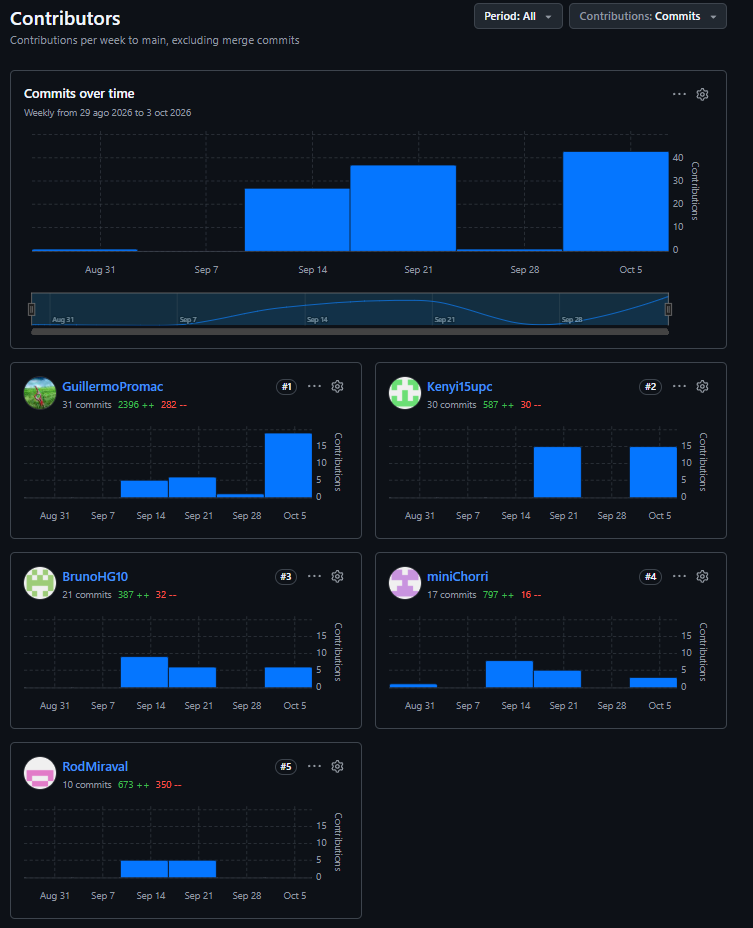

Universidad Peruana De Ciencias Aplicadas

Carrera de Ingeniería de Software

**1ACC0238**

**Aplicaciones para Dispositivos Móviles**

NRC  
**13986**

Docente  
**Salazar Ruiz, Kevin Edgar**

**Informe del Trabajo Final**

Equipo  
**QoriTech**

Proyecto  
**Rutana**

**Integrantes**

<table style="margin: 0 auto; border-collapse: collapse; text-align: left;">
  <thead>
    <tr>
      <th style="padding: 8px 16px;">Código</th>
      <th style="padding: 8px 16px;">Apellidos y Nombres</th>
    </tr>
  </thead>
  <tbody>
    <tr>
      <td style="padding: 8px 16px;">U202315968</td>
      <td style="padding: 8px 16px;">Costa Morales, Christofer William</td>
    </tr>
    <tr>
      <td style="padding: 8px 16px;">U202222275</td>
      <td style="padding: 8px 16px;;">Howard Robles, Guillermoo Arturo</td>
    </tr>
    <tr>
      <td style="padding: 8px 16px;">U202117762</td>
      <td style="padding: 8px 16px;">Huaman Gallardo, Bruno Aldair</td>
    </tr>
    <tr>
      <td style="padding: 8px 16px;">U202311082</td>
      <td style="padding: 8px 16px;">Miraval Pomalaya, Rodrigo Jesus</td>
    </tr>
    <tr>
      <td style="padding: 8px 16px;">U202220138</td>
      <td style="padding: 8px 16px;">Ramirez Cabrera, Kenyi Efrain</td>
    </tr>
  </tbody>
</table>

**Período 202620**

**Agosto 2026**

## Registro de Versiones del Informe

| Versión |   Fecha    | Autor                            | Descripción de modificación          |
|:-------:|:----------:|----------------------------------|--------------------------------------|
|   0.1   | 16/09/2026 | Howard Robles, Guillermo Arturo  | Creación del del cover inicial.      |
|   0.2   | 16/09/2026 | Howard Robles, Guillermo Arturo  | Creación del startup profile.        |
|   0.3   | 16/09/2026 | Howard Robles, Guillermo Arturo  | Creación de los segmentos objetivos. |
|   0.4   | 19/09/2026 | Howard Robles, Guillermo Arturo  | creacion del outcome.                |
|   0.8   | 19/09/2026 | Howard Robles, Guillermo Arturo  | Creación del eventstorming.          |
|   1.1   | 06/10/2026 | Howard Robles, Guillermo Arturo  | Creación del sprint planning 1.      |
|1.2      | 07/10/2026 | Costa Morales, Christofer William  | Creación del Product Implementation & Validation.      |
|1.3      | 07/10/2026 | Howard Robles, Guillermo Arturo  | Creación de la biliografia.   |
| 1.4   | 07/10/2026 | Howard Robles, Guillermo Arturo  | Creación del user stories.      |
|1.5 | 08/10/2026 | Ramirez Cabrera, Kenyi Efrain  | Añadido de los prototipos.      |
| 1.6| 08/10/2026 | Howard Robles, Guillermo Arturo  | Creación del sprint backlog 1.      |
| 1.7| 08/10/2026 | Howard Robles, Guillermo Arturo  | Creación de la pruebas de execución 1.      |
| 1.8 | 08/10/2026 | Howard Robles, Guillermo Arturo  | Añadido de la colaboración en el sprint 1.      |
| 1.9 | 08/10/2026 | Howard Robles, Guillermo Arturo  | Añadido development evidence 1.      |
| 1.10 | 09/10/2026 | Howard Robles, Guillermo Arturo  | Añadido del report collaboration Insights.      |

---

## Project Report Collaboration Insights

Esta sección detalla cómo el equipo colaboró para construir el **Final Project Documentation Report** del sistema Rutana, mostrando evidencia de trabajo conjunto mediante commits, revisiones, herramientas de organización y resultados integrados en el informe final. Se refleja la contribución de cada integrante en la planificación, desarrollo, documentación y presentación de la solución.

**Repositorio del informe del proyecto:**  
[https://github.com/PlaceHolder-13986](https://github.com/PlaceHolder-13986)

- **Total de commits:** 109
- **Autores contribuyentes:**
    - Christofer Costa (`miniChorri`)
    - Guillermo Howard (`GuillermoPromac`)
    - Bruno Huaman (`BrunoHG10`)
    - Rodrigo Miraval (`RodMiraval`)
    - Kenyi Ramirez (`Kenyi15upc`)
- Actividad distribuida por ramas correspondientes a cada sección del informe.
- Todos los miembros participaron activamente en la redacción y revisión del contenido.

## Tabla de contenido

- [Chapter I: Introduction](02-cap1-presentacion.md#Capítulo-I:-Presentación)

## Student Outcome 7

**Criterio:** La capacidad de adquirir y aplicar nuevos conocimientos según sea necesario, utilizando estrategias de aprendizaje apropiadas.

<table border="1" style="width: 100%; border-collapse: collapse;">
<thead>
    <tr>
        <th style="padding: 20px; text-align: left; width: 18%;">Criterio específico</th>
        <th style="padding: 20px; text-align: left; width: 50%;">Acciones realizadas</th>
        <th style="padding: 20px; text-align: left; width: 32%;">Conclusiones</th>
    </tr>
</thead>
<tbody>
    <tr>
        <td style="padding: 15px; text-align: left; vertical-align: top; font-weight: bold;">Actualiza conceptos y conocimientos necesarios para su desarrollo profesional y en especial para su proyecto en soluciones de software</td>
        <td style="padding: 15px; text-align: left; vertical-align: top;">
            <strong>Costa Morales, Christofer William</strong> 
            <strong>AV1:</strong> Actualizó sus conocimientos prácticos sobre metodologías ágiles de diseño de producto al liderar el proceso de Lean UX, elaborando los Problem Statements, Assumptions, Hypothesis Statements y el Lean UX Canvas.  
            <strong>TP1:</strong> Como líder del bounded context <strong>IAM</strong>, actualizó sus conocimientos sobre autenticación y gestión de identidad: elaboró el Bounded Context Canvas de IAM y su diseño táctico (Domain, Interface, Application e Infrastructure Layer, con el agregado User, el control de roles y la emisión de tokens JWT). En el Sprint 1 impulsó el primer avance del módulo con el registro de cuenta: endpoint de registro, validación de datos con manejo de errores 400 y formulario de registro en el frontend. Como colaborador, apoyó en Suscriptions, Fleet, CRM y Planning.  
            <strong>Howard Robles, Guillermo Arturo</strong> 
            <strong>AV1:</strong> Actualizó sus conocimientos aplicados en las etapas iniciales del proyecto mediante la investigación del Startup Profile, antecedentes y delimitación de la problemática, definición de los segmentos objetivo, estructuración del Product Backlog y aplicación del Strategic-Level Domain-Driven Design mediante EventStorming.  
            <strong>TP1:</strong> Como líder del bounded context <strong>Suscriptions</strong>, actualizó sus conocimientos sobre modelos SaaS y gestión de planes y pagos: elaboró el Bounded Context Canvas de Suscriptions y modeló el flujo de contratación (DS-01: registro, creación de organización, pago y activación). En el Sprint 1 avanzó con el modelo de planes y suscripciones, el endpoint para suscribirse a un plan, la vista de selección de planes y la asignación de personal a la organización, además de preparar el Sprint Planning 1 y la integración con IAM. Como colaborador, apoyó en IAM, Fleet, CRM y Planning.  
            <strong>Huaman Gallardo, Bruno Aldair</strong> 
            <strong>AV1:</strong> Actualizó e integró conocimientos de investigación de mercado y modelado de dominio al elaborar el Análisis Competitivo (junto con estrategias/tácticas frente a competidores), el Big Picture EventStorming y la definición del Ubiquitous Language.  
            <strong>TP1:</strong> Como líder del bounded context <strong>Fleet</strong>, actualizó sus conocimientos sobre patrones tácticos de Domain-Driven Design: elaboró el Bounded Context Canvas de Fleet y su diseño táctico (agregado Vehicle, Value Objects LicensePlate, VehicleCapacity y VehicleState, VehicleFactory y la fachada anticorrupción FleetContextFacade). En el Sprint 1 inició el módulo con el modelo y endpoint de registro de vehículos y el formulario de registro de vehículo en el frontend. Como colaborador, apoyó en IAM, Suscriptions, CRM y Planning.  
            <strong>Miraval Pomalaya, Rodrigo Jesus</strong> 
            <strong>AV1:</strong> Actualizó sus capacidades metodológicas de levantamiento de información y especificación de requerimientos mediante la ejecución de entrevistas (diseño, registro y análisis), elaboración del Impact Mapping y redacción de las User Stories.  
            <strong>TP1:</strong> Como líder del bounded context <strong>CRM</strong>, actualizó sus conocimientos sobre gestión de clientes y geolocalización: elaboró el Bounded Context Canvas de CRM y modeló el flujo de registro de clientes y ubicaciones (DS-02). En el Sprint 1 avanzó con el modelo y endpoint de registro de clientes, los endpoints de listar, editar y eliminar clientes, el modelo y endpoint de ubicaciones, la asignación de ubicación a un cliente y los formularios y vistas de gestión en el frontend. Como colaborador, apoyó en IAM, Suscriptions, Fleet y Planning.  
            <strong>Ramirez Cabrera, Kenyi Efrain</strong> 
            <strong>AV1:</strong> Actualizó e implementó herramientas avanzadas de diseño centrado en el usuario (UX) mediante la elaboración de User Personas, User Task Matrix, User Journey Mapping y Empathy Mapping.  
            <strong>TP1:</strong> Como líder del bounded context <strong>Planning</strong>, actualizó sus conocimientos sobre planificación y ejecución de rutas: elaboró el Bounded Context Canvas de Planning y modeló los flujos de planificación, publicación y ejecución de rutas (DS-03 y DS-04). En el Sprint 1 inició el módulo con la integración del servicio de mapas para calcular la ruta y la vista previa de la ruta en el frontend. Como colaborador, apoyó en IAM, Suscriptions, Fleet y CRM.  
        </td>
        <td style="padding: 15px; text-align: left; vertical-align: top;">
            <strong>AV1:</strong> Se definió la visión del producto y objetivos mediante la participación del Product Owner y el equipo. Se elaboraron historias de usuario, análisis de competidores y needfinding. Se aplicó event storming y se diseñaron interfaces UX.  
            <strong>TP1:</strong> Se asignó un líder por bounded context mediante la matriz LACX (IAM: Costa; Suscriptions: Howard; Fleet: Huaman; CRM: Miraval; Planning: Ramirez), de modo que cada integrante profundizó en el dominio y las tecnologías de su módulo. Se elaboraron los Bounded Context Canvases, el Context Map y la arquitectura de software con el C4 Model. En el Sprint 1 se integraron IAM y Suscriptions y se iniciaron los primeros incrementos de Fleet, CRM y Planning.  
        </td>
    </tr>
    <tr>
        <td style="padding: 15px; text-align: left; vertical-align: top; font-weight: bold;">Reconoce la necesidad del aprendizaje permanente para el desempeño profesional y el desarrollo de proyectos en soluciones de software</td>
        <td style="padding: 15px; text-align: left; vertical-align: top;">
            <strong>Costa Morales, Christofer William</strong> 
            <strong>AV1:</strong> Reconoció la necesidad de incorporar nuevas prácticas de desarrollo y coordinación continua en entornos colaborativos.  
            <strong>TP1:</strong> Reconoció la necesidad de profundizar en seguridad (autenticación con JWT, roles y permisos), porque IAM es un contexto del que dependen todos los demás módulos y un error en él afecta a toda la plataforma.  
            <strong>Howard Robles, Guillermo Arturo</strong> 
            <strong>AV1:</strong> Reconoció la importancia del aprendizaje continuo adaptándose al flujo de trabajo colaborativo en las primeras etapas del desarrollo.  
            <strong>TP1:</strong> Reconoció la necesidad de aprender la integración con pasarelas de pago y la comunicación por eventos entre IAM y Suscriptions, para garantizar que el pago active correctamente el acceso a la plataforma.  
            <strong>Huaman Gallardo, Bruno Aldair</strong> 
            <strong>AV1:</strong> Reconoció el impacto de las metodologías ágiles y el control de versiones en el desarrollo continuo de software.  
            <strong>TP1:</strong> Reconoció la necesidad de dominar los patrones de Domain-Driven Design (Aggregate, Factory y Anti-Corruption Layer) para proteger el modelo de Fleet frente a los demás contextos.  
            <strong>Miraval Pomalaya, Rodrigo Jesus</strong> 
            <strong>AV1:</strong> Reconoció la relevancia del trabajo multidisciplinario y la mejora continua en la gestión de proyectos de software.  
            <strong>TP1:</strong> Reconoció la necesidad de aprender el consumo de APIs de mapas y la validación de datos de entrada, porque la calidad de las ubicaciones de CRM determina la calidad de las rutas de Planning.  
            <strong>Ramirez Cabrera, Kenyi Efrain</strong> 
            <strong>AV1:</strong> Reconoció la necesidad de adaptarse a estándares profesionales de gestión de código y colaboración en equipo.  
            <strong>TP1:</strong> Reconoció la necesidad de aprender servicios de mapas y cálculo de rutas, así como el modelado de estados de una ruta, por ser Planning el núcleo del sistema y depender de los demás contextos.  
        </td>
        <td style="padding: 15px; text-align: left; vertical-align: top;">
            <strong>AV1:</strong> Se estableció un flujo de trabajo basado en Gitflow y conventional commits. Se definieron metas semanales y se promovió la participación equitativa. El equipo cumplió con los objetivos del hito.  
            <strong>TP1:</strong> El equipo adoptó un aprendizaje por bounded context: cada líder investigó y aplicó las tecnologías y patrones de su módulo, y los colaboradores lo apoyaron mediante GitFlow y conventional commits. Las dependencias entre contextos (IAM → Suscriptions → Fleet, CRM y Planning) reforzaron la necesidad de aprender de forma coordinada.  
        </td>
    </tr>
</tbody>
</table>

## Objetivos SMART

A continuación, cada integrante del equipo formula su plan de desarrollo profesional posterior a la graduación, con al menos dos objetivos SMART (*Specific, Measurable, Achievable, Relevant, Time-bound*). Los plazos se cuentan desde la fecha de graduación.

***Costa Morales, Christofer William (líder de IAM)***

**Objetivo 1:** Obtener una certificación en ciberseguridad (CompTIA Security+) para especializarme en seguridad de aplicaciones e identidad.

**Objetivo 2:** Publicar un proyecto de autenticación y autorización de código abierto y difundir lo aprendido.

| Objetivo | Specific | Measurable | Achievable | Relevant | Time-bound |
|----------|----------|------------|------------|----------|------------|
| 1 | Aprobar el examen CompTIA Security+. | Certificado aprobado; simulacros mensuales con puntaje ≥ 80 %. | Estudiar 6 horas semanales, apoyándome en la experiencia previa con JWT y roles en IAM. | La seguridad y la gestión de identidad son áreas de alta demanda y se alinean con mi rol en el proyecto. | Dentro de los 8 meses posteriores a la graduación. |
| 2 | Publicar en GitHub un servicio de autenticación (JWT y control de roles) con documentación y pruebas, y escribir artículos técnicos sobre su diseño. | 1 repositorio con cobertura de pruebas ≥ 70 % y 4 artículos publicados. | Reutilizo la experiencia del módulo IAM y dedico 4 horas semanales. | Construye un portafolio verificable para posiciones de backend y seguridad. | Dentro de los 12 meses posteriores a la graduación. |

***Howard Robles, Guillermo Arturo (líder de Suscriptions)***

**Objetivo 1:** Obtener certificaciones de computación en la nube para dominar el despliegue de productos SaaS.

**Objetivo 2:** Incorporarme a un equipo profesional de desarrollo backend o SaaS.

| Objetivo | Specific | Measurable | Achievable | Relevant | Time-bound |
|----------|----------|------------|------------|----------|------------|
| 1 | Aprobar AWS Certified Cloud Practitioner y luego AWS Certified Solutions Architect – Associate. | 2 certificados aprobados. | Estudio progresivo de 5 horas semanales, partiendo de los fundamentos de despliegue ya practicados en el proyecto. | Los modelos SaaS como el de Rutana dependen de arquitecturas en la nube. | Cloud Practitioner en 4 meses y Solutions Architect en 12 meses posteriores a la graduación. |
| 2 | Conseguir mi primer empleo como desarrollador backend o de productos SaaS. | ≥ 10 postulaciones por mes y ≥ 3 entrevistas técnicas realizadas; 1 oferta aceptada. | Cuento con un portafolio académico y con experiencia en el diseño de suscripciones y pagos. | Inicia mi trayectoria profesional en el área en la que me estoy especializando. | Dentro de los 6 meses posteriores a la graduación. |

***Huaman Gallardo, Bruno Aldair (líder de Fleet)***

**Objetivo 1:** Certificarme en Java para fortalecer mi perfil como desarrollador backend.

**Objetivo 2:** Profundizar en Domain-Driven Design y compartir ese conocimiento con la comunidad.

| Objetivo | Specific | Measurable | Achievable | Relevant | Time-bound |
|----------|----------|------------|------------|----------|------------|
| 1 | Aprobar la certificación oficial de Oracle Java SE Professional. | Certificado aprobado; ≥ 1 simulacro semanal en el último mes de estudio con ≥ 75 %. | Dedico 5 horas semanales y parto del uso de Java/Spring en el backend del proyecto. | Java es la base de mi stack backend y la certificación valida mi nivel ante empleadores. | Dentro de los 10 meses posteriores a la graduación. |
| 2 | Leer dos libros de referencia sobre DDD y construir un servicio modular que aplique Aggregates, Factories y Anti-Corruption Layer. | 2 libros leídos, 1 repositorio con pruebas ≥ 70 % y 1 charla dictada en una comunidad o universidad. | Aplico lo que ya trabajé en el diseño táctico de Fleet. | DDD es clave para diseñar sistemas mantenibles y es una competencia diferencial. | Dentro de los 9 meses posteriores a la graduación. |

***Miraval Pomalaya, Rodrigo Jesus (líder de CRM)***

**Objetivo 1:** Certificar mi nivel de inglés para acceder a oportunidades laborales internacionales.

**Objetivo 2:** Obtener una certificación en agilidad para liderar la gestión de requerimientos y equipos de producto.

| Objetivo | Specific | Measurable | Achievable | Relevant | Time-bound |
|----------|----------|------------|------------|----------|------------|
| 1 | Alcanzar el nivel B2 de inglés con un examen oficial (Cambridge, TOEFL o IELTS). | Certificado B2 o superior. | Dedico 5 horas semanales a clases y práctica, con un simulacro cada 2 meses. | El inglés es necesario para documentación técnica y empleos remotos o internacionales. | Dentro de los 12 meses posteriores a la graduación. |
| 2 | Aprobar la certificación Professional Scrum Master I (PSM I). | Examen aprobado con ≥ 85 %. | Parto de mi experiencia en entrevistas, User Stories e Impact Mapping dentro del proyecto. | Fortalece mi perfil en análisis de requerimientos y gestión ágil. | Dentro de los 6 meses posteriores a la graduación. |

***Ramirez Cabrera, Kenyi Efrain (líder de Planning)***

**Objetivo 1:** Publicar una aplicación móvil Android profesional como evidencia de mi dominio de Kotlin.

**Objetivo 2:** Fortalecer mis algoritmos y resolución de problemas para superar procesos de selección técnicos.

| Objetivo | Specific | Measurable | Achievable | Relevant | Time-bound |
|----------|----------|------------|------------|----------|------------|
| 1 | Desarrollar y publicar en Google Play una app Android con Kotlin y Jetpack Compose, con almacenamiento local y consumo de una API REST. | App publicada y ≥ 50 instalaciones. | Reutilizo lo aprendido en la app móvil de Rutana y dedico 6 horas semanales. | Un producto publicado demuestra capacidad real de desarrollo móvil. | Dentro de los 8 meses posteriores a la graduación. |
| 2 | Practicar algoritmos de estructuras de datos y grafos, relacionados con la optimización de rutas. | ≥ 120 problemas resueltos, de los cuales ≥ 40 sean de grafos y rutas. | Cerca de 5 problemas por semana durante 6 meses. | Los procesos de selección técnicos exigen algoritmos y esto refuerza mi trabajo en Planning. | Dentro de los 6 meses posteriores a la graduación. |

